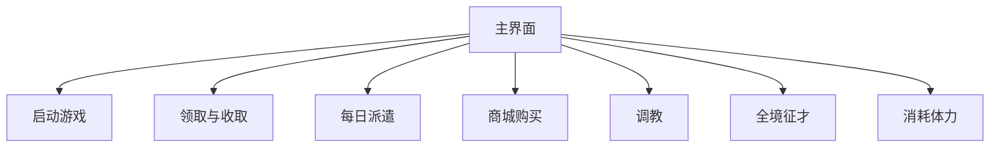

# 功能流程总览

任务文档使用统一结构：功能目标、前置条件、流程图、关键分支、选项、实现映射、当前限制和状态。

| 功能     | 入口节点                  | 风险 | 文档                                |
| -------- | ------------------------- | ---- | ----------------------------------- |
| 启动游戏 | `GameLoginStart`          | 低   | [启动游戏](game_login.md)           |
| 商城购买 | `DailyShopStart`          | 高   | [商城购买](daily_shop.md)           |
| 领取体力 | `DailyFriendStaminaStart` | 低   | [领取体力](daily_friend_stamina.md) |
| 炼金订单 | `DailyAlchemyOrdersStart` | 中   | [炼金订单](daily_alchemy_orders.md) |
| 每日派遣 | `DailyDispatchStart`      | 中   | [每日派遣](daily_dispatch.md)       |
| 消耗体力 | `DailyStaminaStart`       | 高   | [消耗体力](daily_stamina.md)        |
| 调教     | `DailyTrainingStart`      | 高   | [调教](daily_training.md)           |
| 全境征才 | `DailyRecruitmentStart`   | 高   | [全境征才](daily_recruitment.md)    |
| 奖励领取 | `DailyTaskRewardsStart`   | 低   | [奖励领取](daily_task_rewards.md)   |

详细 OCR、ROI、节点名和素材路径只在对应任务文档的实现映射中维护。

加载等待、礼包关闭与主界面恢复见 [公共主界面恢复](common_navigation.md)。
