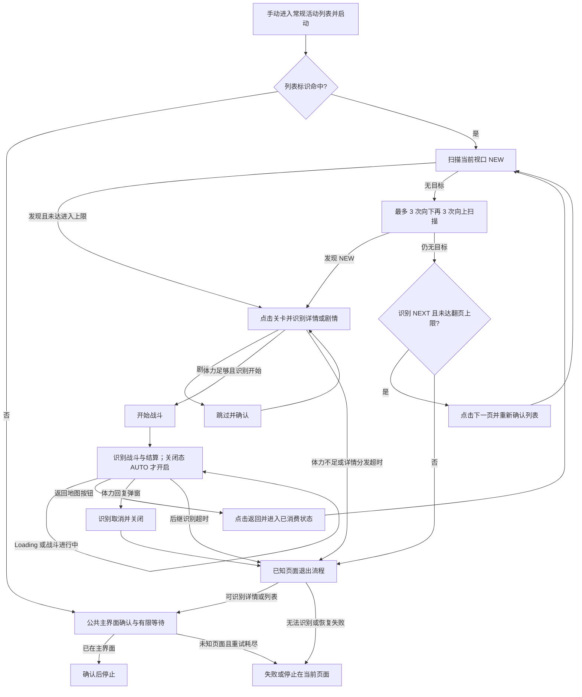

# 自动战斗（AutoBattle）

入口节点：`AutoBattleStart`；主要实现：`assets/resource/pipeline/regular_activity.json`。
本文描述按 `NEW` 推进未通关关卡的自动通关流程。指定关卡的扫荡与手动补刷见[消耗体力](daily_stamina.md)，
实机覆盖状态见[自动战斗验证记录](../records/auto_battle.md)。

## 前置状态与选项

- 手动进入受支持的常规活动本体关卡列表，再启动“自动战斗”。任务不从主界面寻找活动，不选择活动名称，
  也不读取“体力消耗关卡”的 Case。
- 当前列表识别依赖“活动挑战还有”或“斗内点数”，并非任意活动列表都能使用。
- 自动战斗任务未注册 `option`，没有独立的关卡消耗、保留体力、药水或购买开关。
  `RegularActivity*` 回复资源节点仍保留在 Pipeline 中，但默认关闭，不属于该任务已开放的功能。
- 完整流程依赖 `daily_stamina_presets.json` 的体力识别、`daily_stamina.json` 的共用回复弹窗识别和公共节点，
  并需启动注册了 `DailyStaminaCompare` 的 Agent；只加载 `regular_activity.json` 不足以运行。

## 主流程

Loading、奖励弹窗和剧情仅在相应分发节点的 `next` 中处理，不代表任意未知页面都能恢复。
`RegularActivityStageDetailOrStory` 的后继识别超时为 15 秒，`RegularActivityWaitBattleResult` 为 300 秒，
二者的 `on_error` 均进入 `RegularActivityDone`。后继识别超时不等于整个战斗循环的总时长上限。

## NEW 扫描与翻页

1. `RegularActivityStageListDecision` 先确认列表标识，再优先处理当前视口中的 `NEW`。
2. `__RegularActivityNewText` 使用完整 `NEW` 模板并按垂直位置排序；组合节点选择第一项，
   `RegularActivityOpenLatestStage` 按识别框加偏移 `[160,75,0,0]` 点击对应关卡。每轮只进入一个目标。
3. 无目标时依次执行 `RegularActivityScanStageListDown1~3`，手势从 `[360,760]` 到 `[360,360]`；
   再执行 `RegularActivityScanStageListUp1~3`，方向相反。每次滑动 1500 ms，随后重新识别 `NEW`。
4. 六次滑动后仍无目标，才由 `RegularActivityOpenNextPage` 识别列表标识和 `NEXT`，点击 `[680,610]`。
   当前仅检查 `NEXT` 文本，没有独立的锁定/可用态识别，不能宣称已经确认下一页解锁。
5. 翻页或战斗返回后，从当前视口重新走展开的扫描链，不依赖滑动自循环的累计 `max_hit`。
   单次任务进入关卡最多 20 次、点击 `NEXT` 最多 8 次；这些是节点命中上限，不保证实际完成同等数量的关卡。
6. 扫描后没有可处理的目标或达到节点上限时，尝试已知页面退出流程。

## 体力、剧情与战斗决策

- 开始战斗同时要求 `DailyStaminaPresetStaminaEnough` 和“开始”命中。复用的基础体力预设是
  `cost: 50`、`reserve: 0`，比较当前体力是否至少为 50，不会自动读取每个新关卡的实际消耗。
  因此可能在实际关卡仍可挑战时提前退出，不能写成按当前关卡动态计算。
- `DailyStaminaCompare` 无法解析体力时，“足够”和“不足”都不命中，详情分发超时后尝试退出，
  不按足够点击开始。若实际消耗高于判断阈值并弹出回复窗口，则识别“取消”后退出。
- 剧情通过 `REC` 或 `SKIP` 识别，点击跳过后还需识别“确定”或“确认”。
- 战斗等待优先识别结算返回按钮；在 `WAVE`/`TURN` 与灰色 AUTO 关闭态模板同时命中时才点击开启 AUTO，
  已开启的 AUTO 不会被反向关闭。
- 点击结算“返回地图”或“返回”后进入 `RegularActivityConsumedState`，通过
  `RegularActivityLowDecision` 锚点转入已消费判断，再继续列表扫描。
- 独立任务默认不使用药水或购买体力。旧生成模式及消耗体力选项仍有对 `RegularActivity*` 的 Override，
  属于兼容配置；其存在不等于 `AutoBattleStart` 已注册这些选项。兼容模式说明见
  [体力活动配置维护指南](../develop/stamina_activity_config.md#旧自动通关模式的兼容边界)。

## 识别与实现映射

坐标和 ROI 均采用 720×1280 基准；素材路径相对 `assets/resource/image/`。

| 页面状态     | 节点或识别依据                                                                         | ROI / 素材                                                |
| ------------ | -------------------------------------------------------------------------------------- | --------------------------------------------------------- |
| 常规活动列表 | `RegularActivityPresetStageListMarker`：“活动挑战还有”/“斗内点数”                      | `[0,90,720,180]`                                          |
| 未通关关卡   | `__RegularActivityNewText`：模板阈值 0.75，`order_by: Vertical`                        | `[130,160,120,940]`；`RegularActivity/NewStageMarker.png` |
| 下一页       | `__RegularActivityNextPageButton`：`NEXT`                                              | `[610,480,110,220]`                                       |
| 体力         | `DailyStaminaCompare`，位于 `agent/stamina.py`                                         | `[500,0,180,45]`                                          |
| 关卡开始     | `__RegularActivityStartButton`：“开始”                                                 | `[260,1040,210,170]`                                      |
| 剧情         | `__RegularActivityStoryRecMarker` / `__RegularActivityStorySkipButton`                 | `REC`：`[500,40,120,110]`；`SKIP`：`[400,900,320,300]`    |
| 战斗进行中   | `RegularActivityBattleInProgress`：`WAVE`/`TURN`                                       | `[0,40,180,120]`                                          |
| AUTO 关闭态  | `__RegularActivityAutoOffButton`：模板阈值 0.8                                         | `[500,1140,180,110]`；`RegularActivity/AutoOffButton.png` |
| 结算返回     | `__RegularActivityReturnMapButton`：“返回地图”/“返回”                                  | `[300,1120,320,130]`                                      |
| 退出         | `RegularActivityDone`、`RegularActivityReturnMainFrom*`、`CommonStopOnMainWithRetries` | 已知详情、列表、活动选择页与主界面                        |

## 限制与后续扩展

当前只实现上述常规活动列表扫描，不支持复刻活动二维地图、大型活动专用 UI 或后期开启的挑战活动入口。
固定列表 marker、NEW ROI 和翻页识别都需要匹配当前活动；不能仅因页面存在 `NEW` 就视为受支持。

复刻活动自动通关仍是待实现方案：检查当前区域并有限上下扫描，建立底部锚点，再分别移动到左右区域扫描；
任一区域命中 `NEW` 就进入关卡，返回后从当前视口重新开始。左右手势方向、边界识别、单列扫描次数和返回落点
必须先通过实机确认。现有 `DailyStaminaRerun*` 仅用于寻找指定关卡，不代表已经实现复刻自动通关。

## 完成状态

- 扫描范围内已无可处理目标、达到进入/翻页上限或体力不足时结束，不保证活动所有关卡均已通关。
- 已知详情、列表或活动选择页通过 `RegularActivityDone` 尝试返回主界面，再由公共节点确认停止。
- 从主界面误启动会走主界面确认；其他未知页面可能识别失败或停留原页，不能保证自动返回主界面。
- 识别失败、超时退出与正常无目标结束需结合日志区分；本文不代表这些分支已完成实机验证。
