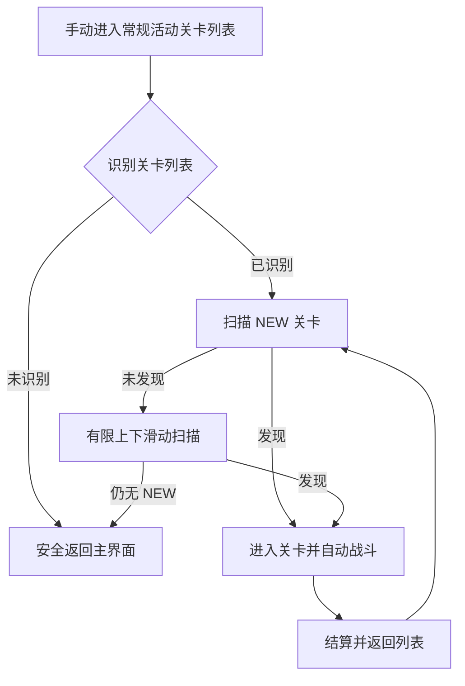

# 自动战斗（AutoBattle）

入口节点：`AutoBattleStart`；实现文件：`assets/resource/pipeline/regular_activity.json`。

## 流程

```mermaid
flowchart TD
    A[手动进入常规活动关卡列表] --> B{识别关卡列表}
    B -->|未识别| C[安全返回主界面]
    B -->|已识别| D[扫描 NEW 关卡]
    D -->|发现| E[进入关卡并自动战斗]
    E --> F[结算并返回列表]
    F --> D
    D -->|未发现| G[有限上下滑动扫描]
    G -->|发现| E
    G -->|仍无 NEW| C
```
