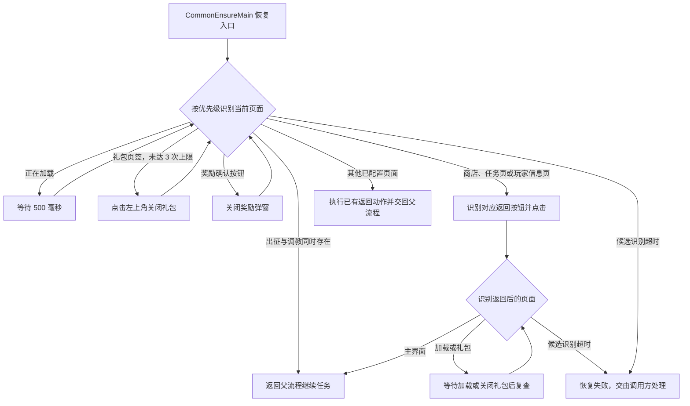
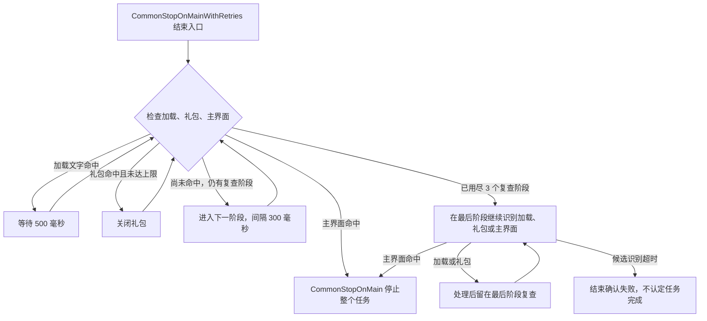

# 公共主界面恢复

实现文件：`assets/resource/pipeline/common.json`、`assets/resource/pipeline/common_return.json`。
入口节点：`CommonEnsureMain`；任务结束确认：`CommonStopOnMainWithRetries`。

## 实机依据

登录后可能出现包含“限时 / 精选 / 月卡”页签的礼包，左上角返回可关闭，原公共恢复流程无法处理。

## 页面流程

恢复入口与任务结束确认用途不同，分别如下。

商店、任务页、玩家信息页的返回节点显式连接主界面确认，候选列表超时为 10 秒。
`CommonEnsureMain` 本身的候选列表超时为 8 秒，失败时如何处理由调用方决定。

三个复查阶段对应 `CommonStopOnMainWait1/2/3`；每阶段候选列表超时为 10 秒，
并非整个任务只等待 900 毫秒或固定 10 秒。结束入口没有任意页面返回动作，也没有普通奖励弹窗处理分支。

- `CommonEnsureMain` 优先处理加载、礼包和奖励确认，再识别主界面，避免已在主界面时多点一次“城堡”。
- 礼包用 `__CommonGiftTabs` 识别 `[100, 95, 530, 75]` 内的完整页签文字，
  `CommonCloseMainGift` 点击 `[40, 75]`，最多 3 次；点击后重新检查页面，不点击购买区。
- 商店底栏、玩家信息和任务页的返回动作取消全屏稳定等待，由目标主界面识别承接页面切换。
- `CommonWaitLoading` 的 ROI 为 `[180, 1158, 360, 92]`，完整覆盖底部加载提示；匹配 `LOADING`、
  `CONNECTING` 并兼容字母间空格。仅在文字命中时等待 500 毫秒再复查，不要求整屏静止。
- 结束重试节点使用短间隔复查，并允许处理加载和礼包。最后必须识别主界面，不能只因点击发出而结束。
- 点击前的 300 毫秒稳定等待保留。

## 完成状态

- `CommonEnsureMain` 返回父流程；`CommonStopOnMain` 则在主界面识别成功后停止整个任务。
