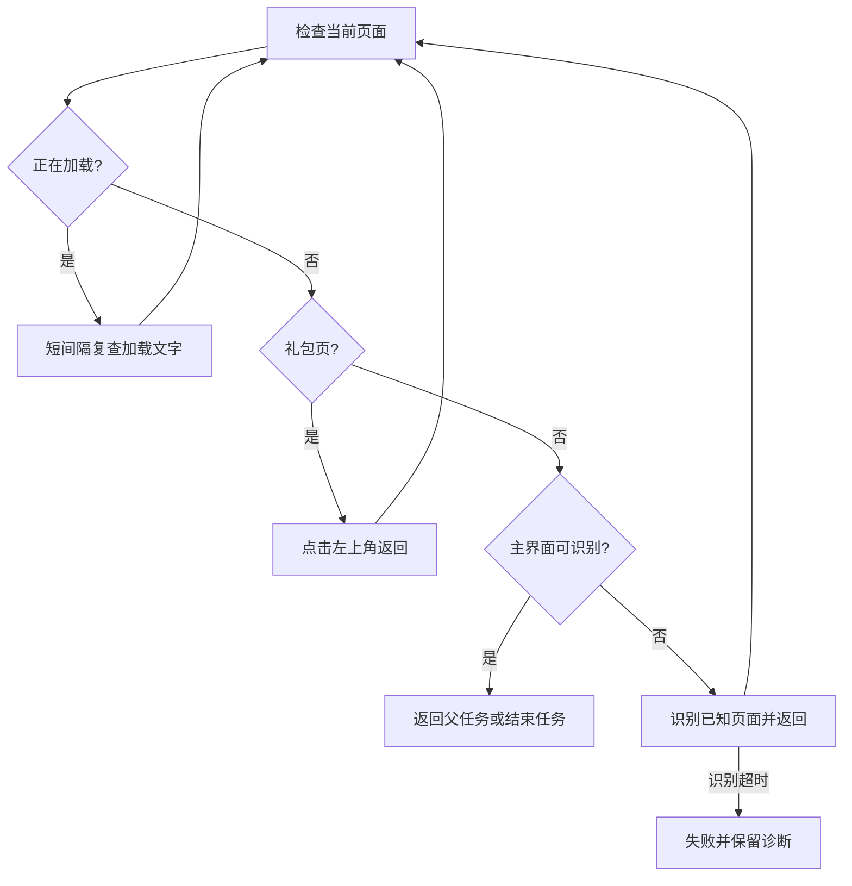

# 公共主界面恢复

实现文件：`assets/resource/pipeline/common.json`、`assets/resource/pipeline/common_return.json`。
入口节点：`CommonEnsureMain`；任务结束确认：`CommonStopOnMainWithRetries`。

## 实机依据

2026-09-13 在客户端 2.3.0、MuMuPlayer v5+ 上观察到：主界面角色持续运动；关闭好友页、任务页或礼包后，
全屏稳定等待达到默认 20 秒上限。此时页面已返回，不能把这类超时等同于网络仍在加载。
登录后可能出现包含“限时 / 精选 / 月卡”页签的礼包，左上角返回可关闭，原公共恢复流程无法处理。

## 页面流程

- `CommonEnsureMain` 优先处理加载、礼包，再识别主界面，避免已在主界面时多点一次“城堡”。
- 礼包用 `__CommonGiftTabs` 识别 `[100, 95, 530, 75]` 内的完整页签文字，
  `CommonCloseMainGift` 点击 `[40, 75]`，最多 3 次；点击后重新检查页面，不点击购买区。
- 商店底栏、玩家信息和任务页的返回动作取消全屏稳定等待，由目标主界面识别承接页面切换。
- `CommonWaitLoading` 的 ROI 为 `[180, 1158, 360, 92]`，完整覆盖底部加载提示；匹配 `LOADING`、
  `CONNECTING` 并兼容字母间空格。仅在文字命中时等待 500 毫秒再复查，不要求整屏静止。
- 结束重试节点使用短间隔复查，并允许处理加载和礼包。最后必须识别主界面，不能只因点击发出而结束。
- 点击前的 300 毫秒稳定等待保留。其他任务未实测的返回路径不据此宣称通过。

## 完成状态与当前状态

- `CommonEnsureMain` 返回父流程；`CommonStopOnMain` 在主界面识别成功后停止整个任务。
- 2026-09-13，客户端 2.3.0，MuMuPlayer v5+，MaaMCP：已在主界面、玩家信息页、任务页、商店页
  分别验证 `CommonEnsureMain`，均重新识别主界面后正常结束；从礼包起点启动好友体力也自动恢复并完成。
- 上述路径未再出现 20 秒全屏稳定等待超时；游戏网络异常、其他任务页面的返回路径仍待验证。
