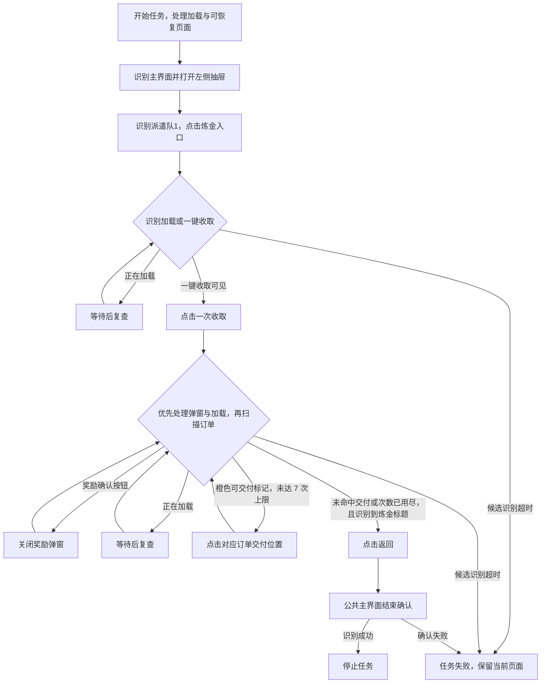

# 炼金订单（DailyAlchemyOrders）

入口节点：`DailyAlchemyOrdersStart`；实现文件：`assets/resource/pipeline/daily_alchemy_orders.json`。

## 前置状态

- 游戏位于主界面，左侧抽屉和炼金页面可访问。
- 炼金收益或可交付订单可以为空。

## 主流程

1. 打开主界面左侧抽屉并进入炼金页面。
2. 出现“一键收取”时领取已完成的炼金收益并关闭奖励弹窗。
3. 扫描当前页面的可交付订单，逐项点击交付并关闭奖励弹窗。
4. 没有更多可交付订单时返回主界面。

收取按钮存在不代表有收益；空收益时仍会点击一次，然后在没有奖励弹窗的情况下进入订单扫描。
图中“未命中交付”表示识别结果，不能证明所有订单均已完成；达到交付次数上限也会尝试返回。
打开抽屉与返回主界面由后续识别承接，不等待整屏静止。公共结束确认见 [公共主界面恢复](common_navigation.md)。

## 页面识别

| 页面状态   | 识别目标          | 识别方式       | ROI/素材         |
| ---------- | ----------------- | -------------- | ---------------- |
| 主界面     | `CommonMainReady` | And + OCR      | 通用主界面节点   |
| 左侧抽屉   | 派遣队1           | OCR            | 抽屉状态区       |
| 收取按钮   | 一键收取或键收取  | OCR            | 炼金页下方按钮区 |
| 可交付订单 | 橙色可交付状态块  | HSV ColorMatch | 订单列表区域     |
| 炼金页面   | 炼金              | OCR            | 页面标题区       |

## 异常与分支

- 2026-09-13 实测发现打开抽屉与返回主界面的全屏静止等待受角色动画影响，各耗尽约 20 秒。
  这两处改为由后续抽屉识别及公共主界面确认承接，保留点击前稳定等待。

- 当前客户端无可收取收益时仍显示“一键收取”；任务会点击一次，未出现奖励弹窗时继续扫描订单。
  按钮完全缺失的页面尚未验证，当前进入炼金后的候选仅包含加载和收取按钮，不能宣称支持缺失按钮时跳过。
- 无可交付订单时结束扫描；交付次数受 `max_hit` 限制，避免颜色误识别导致循环。
- 奖励弹窗统一由 `CommonCloseReward` 关闭后回到订单扫描。

## 完成状态

- 正常目标：处理当前可见的可交付订单，或没有可交付订单时返回。
- 实际结束条件：订单扫描转入返回节点，并通过公共主界面确认；达到 7 次交付上限也可能结束，不能仅凭停止状态断言订单全部完成。
- 安全退出位置：游戏主界面。

## 当前状态

- 2026-09-13，客户端 2.3.0，MuMuPlayer v5+，MaaMCP 原生截图与输入：基线实际覆盖收益收取、
  两次可见订单交付及奖励确认，最终回到主界面；打开抽屉和返回主界面各出现一次约 20 秒等待超时。
- 修复后完整入口到主界面通过，覆盖点击无收益的一键收取、无可交付订单及结束确认，耗时约 10.4 秒，
  未发生稳定等待或动作失败。同为空状态的旧配置约 50.0 秒；含交付的基线约 65.1 秒，工作量不同不直接比较。
- 修复只调整抽屉打开与返回等待；实际交付已在修复前覆盖，修复后尚无新订单可再次验证。
  按钮缺失、网络慢加载、订单数量上限及仓库异常分支仍待验证。
