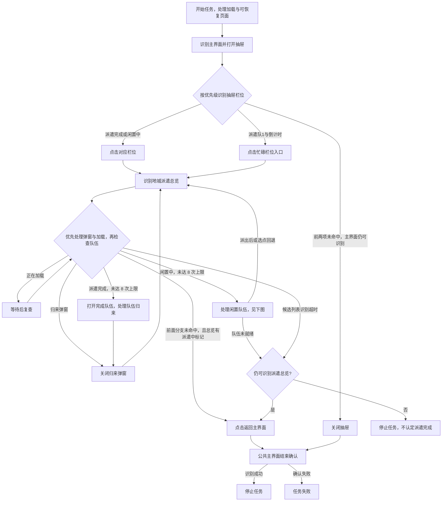
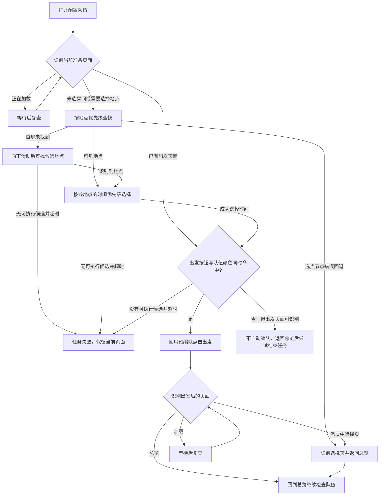

# 每日派遣（DailyDispatch）

入口节点：`DailyDispatchStart`；实现文件：`assets/resource/pipeline/daily_dispatch.json`。

## 前置状态

- 游戏位于主界面，地城派遣功能已解锁。
- 确认“派遣地点优先级”和“派遣时间优先级”。
- 所有需要助手处理的派遣栏位均已在游戏内编好可出发队伍；助手不会自动编队或补充角色。

## 主流程

1. 打开左侧抽屉，根据栏位状态进入地城派遣总览。
2. 优先打开“派遣完成”栏位，收回队伍并关闭归来弹窗。
3. 打开“闲置中”栏位，按配置顺序选择地点和派遣时长。
4. 检查预先编好的队伍是否满足出发条件；满足后派出，继续扫描其他栏位。
5. 队伍未就绪时不进行编队，返回派遣总览后退出到主界面；全部忙碌时同样返回主界面。

“全部忙碌”分支是前面的完成、闲置候选均未命中后，再识别总览标题与至少一个派遣中标记，
并不逐一统计所有队伍。出发后返回总览继续扫描，不是派出一个队伍就结束。
公共结束确认见 [公共主界面恢复](common_navigation.md)。

闲置队伍的选点、选时与出发子流程如下；该子流程尚待实机验证。

选项通过调整候选顺序生效；图中不将某一个地点或时长视为固定默认。
滑动后的候选列表、各时间节点的继续尝试与错误回退以 Pipeline 为准，不表示任意选点失败都能返回总览。

## 页面识别

| 页面状态   | 识别目标                          | 识别方式            | ROI/素材         |
| ---------- | --------------------------------- | ------------------- | ---------------- |
| 抽屉栏位   | 派遣完成、闲置中、派遣队1与倒计时 | OCR/And             | 左侧抽屉栏位区   |
| 派遣总览   | 地城派遣                          | OCR                 | 页面标题区       |
| 归来弹窗   | 队伍归来/隊伍歸來                 | OCR                 | 弹窗内容区       |
| 地点与时间 | 地点名称和对应时间按钮            | OCR + target offset | 选择页面         |
| 队伍就绪   | 出发按钮和队伍槽蓝绿色            | And + ColorMatch    | 队伍与底部按钮区 |

## 异常与分支

- 全忙碌路径中，打开抽屉、从倒计时栏位进入总览、返回主界面均由下一页面识别承接。
  当前动画会令原全屏静止等待各超时约 20 秒，因此移除这三处动作后等待，保留点击前稳定等待。

- 队伍未满足出发条件时不自动编队或补充角色，返回派遣总览后退出到主界面并结束任务。
- 选点节点配置了返回总览的错误回退；返回后会继续扫描，可能再次进入闲置栏位，受最多 8 次打开限制。
  各时间节点的失败路径不同，不能保证所有“无可选时间”情形都能正常退出。
- 完成与闲置候选未命中后，识别总览标题及派遣中标记才执行忙碌返回；无任何可执行候选时走超时恢复。
- “派遣完成”和“闲置中”栏位分别最多打开 8 次，允许四个栏位各有一次额外尝试，但异常识别不能
  无限重复。达到上限或总览 6 秒内无法进入任何已知分支时，确认仍在地城派遣总览后返回主界面；
  无法确认总览则直接停止，不在未知页面点击返回坐标。
- 地点/时间优先级通过 `pipeline_override` 调整 `next` 顺序，目标节点必须预先存在。

## 完成状态

- 正常目标：收回完成队伍，并使用预编队处理可出发的闲置队伍。
- 实际结束条件：无可继续处理的候选、队伍未就绪或总览超时回退后，返回并确认主界面；无法识别总览时还可直接停止。
  停止状态本身不能证明全部队伍均已处理，需结合命中分支判断。
- 安全退出位置：游戏主界面；预编队未满足出发条件时保留闲置队伍。

## 当前状态

- 2026-09-13，客户端 2.3.0，MuMuPlayer v5+，MaaMCP 原生截图与输入：三个队伍均忙碌，
  完整入口覆盖打开抽屉、按倒计时进入地城派遣总览、识别忙碌状态并返回确认主界面。
- 修复前约 66.9 秒，三处全屏等待均触发约 20 秒超时；重新连接并加载修复后约 7.3 秒，
  无稳定等待或动作失败。未取消派遣、改变队伍或派出新队伍。
- 完成队伍归来、闲置队伍出发、队伍未就绪、各地点和时间选项及超时恢复仍待验证；
  本轮未加载 Interface Case Override，不将默认分支测试算作选项覆盖。
