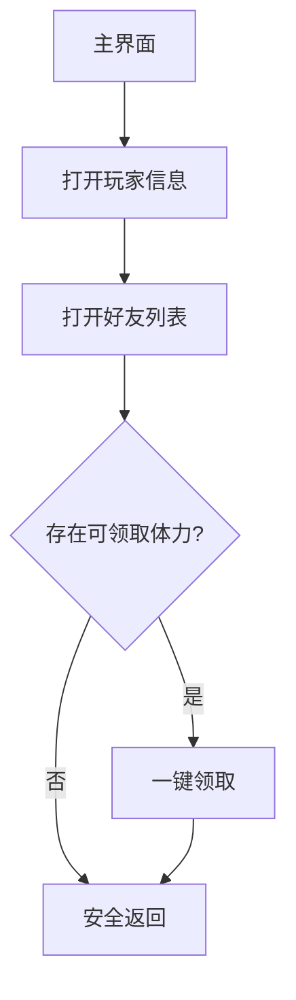

# 领取体力（DailyFriendStamina）

入口节点：`DailyFriendStaminaStart`；实现文件：`assets/resource/pipeline/daily_friend_stamina.json`。

## 前置状态

- 游戏位于主界面，玩家信息和好友清单可正常打开。
- 好友赠送体力可以为零；无可领取内容也应正常结束。

## 主流程

1. 从主界面点击头像进入玩家信息页。
2. 切换到好友清单并等待列表加载完成。
3. 出现“一键领取”时点击一次；未出现时直接关闭页面。
4. 返回主界面并停止任务。

## 页面识别

| 页面状态 | 识别目标                 | 识别方式  | ROI/素材       |
| -------- | ------------------------ | --------- | -------------- |
| 主界面   | `CommonMainReady`        | And + OCR | 通用主界面节点 |
| 玩家信息 | 玩家信息                 | OCR       | 页面标题区     |
| 好友加载 | `LOADING` 或能量获取计数 | Or + OCR  | 好友列表区域   |
| 可领取   | 一键领取或键领取         | OCR       | 页面右下按钮区 |
| 好友页面 | 好友清单或玩家信息       | OCR       | 顶部页签区     |

## 异常与分支

- 返回主界面及重新进入前取消全屏稳定等待，交给目标页面识别与公共结束确认；入口通过公共恢复关闭礼包。
- 好友列表持续加载时，`DailyFriendStaminaWaitFriendListLoading` 最多等待 8 次；达到上限后关闭页面并
  重新进入一次。`DailyFriendStaminaCloseProfileForRetry` 最多命中一次，防止持续异常时反复打开好友页。
- 无赠送体力时不会点击固定坐标，而是直接关闭页面。
- “一键领取”设置单次命中限制，避免页面未刷新时重复点击。

## 完成状态

- 成功条件：已领取可用体力，或确认当前没有可领取体力。
- 安全退出位置：游戏主界面。

## 当前状态

- 2026-09-13，客户端 2.3.0，MuMuPlayer v5+，MaaMCP 原生截图与输入：无遮挡主界面及限时礼包
  遮挡起点均通过，覆盖自动关闭礼包、打开玩家信息与好友清单、点击一键领取、返回并确认主界面。
- 修复后未再出现关闭玩家信息页的 20 秒全屏稳定等待超时；登录后直接运行本任务的衔接通过。
- 无可领取内容、好友列表持续加载及重新进入分支仍待验证。公共恢复详见 [公共主界面恢复](common_navigation.md)。
