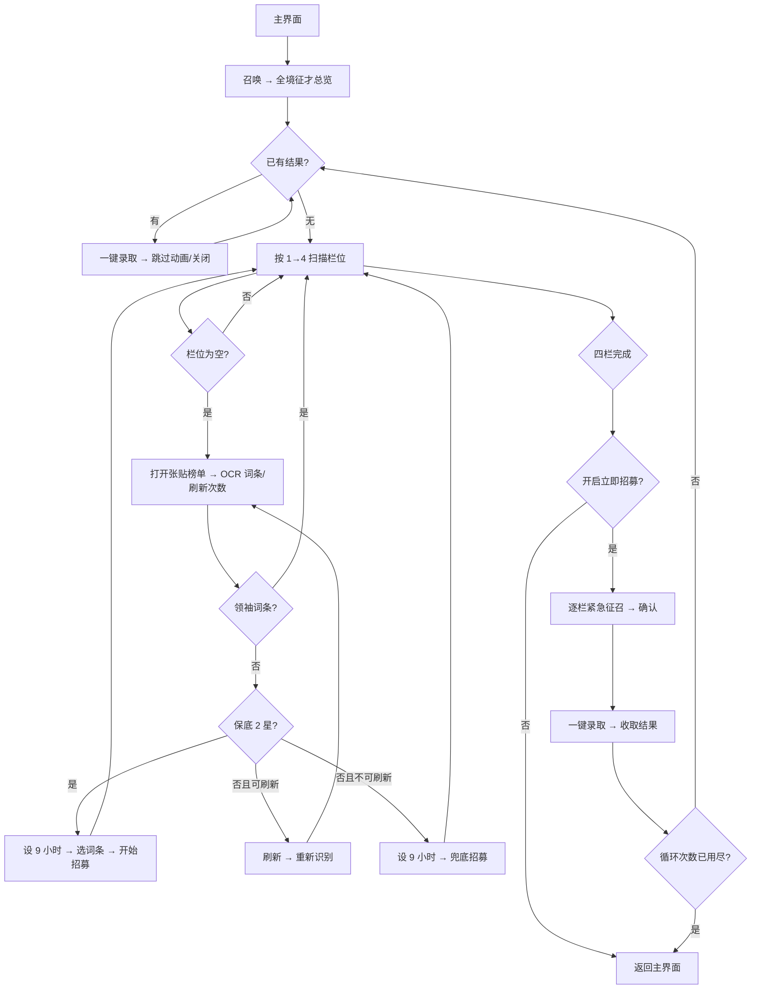

# 全境征才（DailyRecruitment）

入口节点：`DailyRecruitmentStart`；实现文件：`assets/resource/pipeline/daily_recruitment.json`、`agent/recruitment.py`。

## 前置状态

- 游戏位于主界面，全境征才功能已解锁。
- 确认“全境征才立即招募”开关；启用后会消耗立即招募资源。
- 四个栏位可以为空、招募中或已有结果。

## 主流程

1. 从主界面进入召唤页和全境征才总览，优先领取已有结果。
2. 总览 Router 每轮重新识别四个栏位；发现空栏位时打开张贴榜单页面，并 OCR 读取词条与刷新次数。
3. Agent 计算最优组合：领袖词条跳过；保底 2 星时设置 9 小时并选择词条；无保底且可刷新时刷新；否则兜底招募。
4. 开启立即招募时，四栏处理完后逐个执行立即招募/紧急征召，再统一执行一键录取；收取完成后留在总览并开始下一轮，直到达到“全境征才循环次数”。
5. 未开启立即招募时，四栏处理完成后直接返回主界面。

## 页面识别

| 页面状态   | 识别目标                     | 识别方式      | ROI/素材                          |
| ---------- | ---------------------------- | ------------- | --------------------------------- |
| 主界面入口 | 召唤按钮                     | TemplateMatch | `DailyRecruitment/SummonText.png` |
| 征才总览   | 全境征才、张贴榜单、一键录取 | OCR/And       | 标题、四栏及底部按钮区            |
| 词条决策   | 已知词条与刷新次数           | Agent 内 OCR  | `TAG_ROI`、`REFRESH_ROI`          |
| 招募设置   | 招募时间、开始招募           | OCR           | 设置页和底部按钮                  |
| 立即处理   | 立即招募/紧急征召            | OCR/And       | 总览栏位区                        |

## 异常与分支

- 已在招募中的栏位不会进入设置页；四栏均非空时由总览标题确认扫描完成。刷新最多执行有限次数，之后强制走兜底招募。
- 每个空栏位在单次任务中最多打开一次；出现领袖词条并取消设置后，该栏位保持为空，但总览 Router 会跳过已处理栏位并继续扫描后续栏位，避免重复打开形成死循环。
- 无有效词条或 OCR 失败时不选择词条，但仍设置 9 小时并尝试开始招募。
- 词条优先按五个按钮的窄 ROI 逐项识别；宽 ROI 仅作漏识别补充，并使用 OCR 检测框定位实际按钮。
- 启用立即招募时先处理所有立即按钮，再一键录取，避免每栏重复结算。
- “全境征才循环次数”仅在启用立即招募时显示；每轮回到总览前会清理栏位和立即招募节点的 `max_hit` 计数，避免上一轮状态阻止下一轮扫描。
- 一键录取后的角色展示会持续播放动画，收获链不等待整屏冻结，而是持续识别 `SKIP` 和结果汇总页的“关闭”；只有“关闭”超时未识别时才点击底部兜底坐标。
- 栏位处理完成后统一返回总览 Router；兜底点击“开始招募”前必须先识别设置页的“招募时间”，若状态与已知页面均不匹配则停止。

## 完成状态

- 成功条件：四栏均已跳过、开始招募或保持原有招募状态，已有结果已按配置领取。
- 安全退出位置：游戏主界面；识别不确定时不得消耗立即招募资源。

## 当前状态

- 主流程：已实现，详细流程以当前 Pipeline 为准。
- 2026-09-13 实机验证（客户端 2.3.0、MuMuPlayer v5+、720×1280）：关闭“立即招募”运行 1 轮，成功从主界面进入总览，扫描并处理四个空栏位，识别保底组合后设置 9 小时并开始招募，最终返回主界面。未消耗立即招募资源；本轮普通招募栏位状态发生变化。
- 同日以循环次数 1 开启“立即招募”完成 1 轮实机验证：识别并点击四个“紧急征召”，确认后执行一键录取和结果收取，最终返回主界面。游戏货币由 2,596,944 降至 2,591,844（消耗 5,100）；未出现付费加速提示。
- 本次覆盖正常路径、四栏空位处理、立即招募确认和一键录取；未覆盖已有结果领取、领袖词条跳过、刷新耗尽、循环次数大于 1、招募资源不足和网络异常。上述分支继续保持待验证。
- 历史实机日志：不在公开文档中维护。
