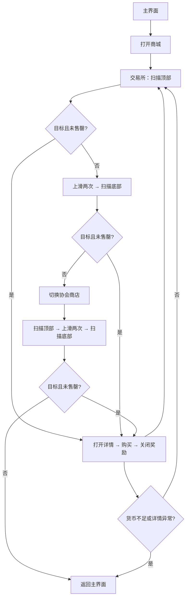

# 商城购买（DailyShop）

入口节点：`DailyShopStart`；实现文件：`assets/resource/pipeline/daily_shop.json`、`agent/daily_shop.py`。

## 前置状态

- 游戏位于主界面，商城和协会商店可访问。
- 确认“指定购买物品”和“指定协会商店购买物品”清单，并确保账号货币足够。
- 本任务会实际消耗货币，实机验证前应使用低风险商品和可控账号。

## 主流程

1. 从主界面打开商城，进入每日交易所。
2. OCR 读取交易所顶部商品，跳过售罄项并购买所有匹配目标；随后连续上滑两次到达底部，只扫描并购买底部目标，不处理中间画面的商品。
3. 切换协会商店，以相同方式只扫描顶部和底部并购买协会商店目标。
4. 每次购买后关闭奖励页并标记当前商品已处理，全部扫描结束后点击“城堡”返回主界面；点击后直接进入加载与主界面识别，不等待整个主界面静止。

## 页面识别

| 页面状态        | 识别目标                             | 识别方式     | ROI/素材           |
| --------------- | ------------------------------------ | ------------ | ------------------ |
| 主界面入口      | 商城                                 | OCR          | 底栏商城区域       |
| 交易所/协会商店 | 交易所、协会商店                     | OCR          | 商店页签区域       |
| 目标商品        | 商品名称与售罄英文横幅               | Agent 内 OCR | 完整商品卡区域     |
| 购买详情        | 购买、当前持有不足                   | OCR          | 详情页按钮与提示区 |
| 购买结果        | 获得奖励、奖励已增加至仓库或获得道具 | OCR          | 奖励弹窗           |

## 异常与分支

- Agent 按商店、槽位和可见状态去重；同名且未售罄的不同槽位仍会分别处理。
- 每个槽位以覆盖列表顶部、底部约 15px 偏移的完整商品卡 ROI 执行一次 OCR；名称支持输入片段匹配完整商品名，卡片出现 `SOLD OUT`、`CURRENTLY` 或至少 3 个连续英文字母时按售罄处理，数量标记 `x1`、`x2` 等不会触发。
- 货币不足时关闭提示并返回主界面；详情页未识别到购买按钮时先关闭详情再继续扫描。
- 奖励文字漏识别但确认按钮存在时，恢复节点会补记购买状态后关闭弹窗，避免重复购买。
- 商品名、售罄样式或商店列表布局变化时必须重新采集 ROI，不得依赖模糊坐标继续购买。

## 完成状态

- 成功条件：交易所和协会商店均完成有限段扫描。
- 安全退出位置：游戏主界面；货币不足或购买页状态不明时提前返回。`DailyShopReturnMain` 经 `DailyShopDone` 进入 `CommonStopOnMainWithRetries`，确认“出征”和“调教”同时可见后结束；加载与主界面礼包由公共节点处理。
