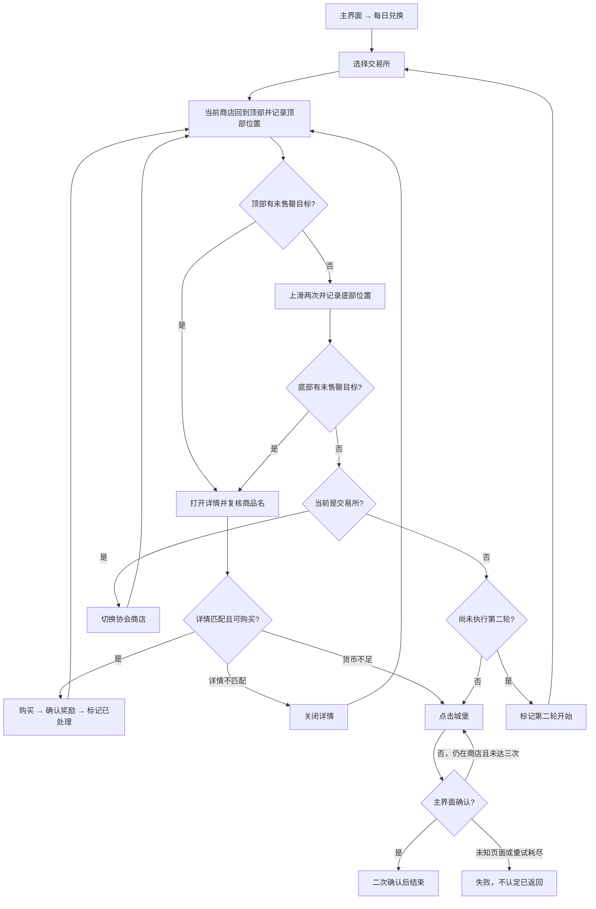

# 商城购买（DailyShop）

按指定商品清单扫描交易所与协会商店，购买匹配目标后返回主界面。

## 使用前提

- 游戏位于主界面，商城和协会商店可访问。
- 确认“指定购买物品”和“指定协会商店购买物品”清单，并确保账号货币足够。
- 本任务会实际消耗货币，实机验证前应使用低风险商品和可控账号。

## 选项与资源消耗

| 选项                 | 输入方式                   | 行为与限制                             |
| -------------------- | -------------------------- | -------------------------------------- |
| 指定购买物品         | 单行商品列表，以 `\|` 分隔 | 交易所目标，详情页再次核对名称后购买   |
| 指定协会商店购买物品 | 单行商品列表，以 `\|` 分隔 | 协会商店目标，与交易所分别记录购买状态 |

默认商品清单以 `assets/interface.json` 同名选项的 `inputs.default` 为准，不在文档重复维护。名称支持片段匹配，应避免过短且可能匹配多个商品的输入。本任务会实际消耗对应商店货币。

## 页面流程

1. 从主界面打开商城，进入每日交易所。
2. OCR 读取交易所顶部商品，跳过售罄项并购买所有匹配目标；随后连续上滑两次到达底部，只扫描并购买底部目标，不处理中间画面的商品。
3. 首轮交易所和协会商店扫描结束后，回到交易所顶部重新执行一轮完整扫描，再扫描协会商店。第二轮补捞首轮 OCR 漏掉的目标。
4. 每次购买前在详情页再次核对商品名称；购买后关闭奖励页并标记当前商店、列表位置和槽位已处理，然后把当前商店列表回到顶部再扫描。两轮扫描完成后点击“城堡”返回主界面；点击后识别主界面，仍在商店时有限重试，不等待整个主界面静止。

```mermaid
flowchart TD
    A[主界面 → 每日兑换] --> B[选择交易所]
    B --> C[当前商店回到顶部并记录顶部位置]
    C --> D{顶部有未售罄目标?}
    D -->|是| E[打开详情并复核商品名]
    D -->|否| F[上滑两次并记录底部位置]
    F --> G{底部有未售罄目标?}
    G -->|是| E
    E --> H{详情匹配且可购买?}
    H -->|是| I[购买 → 确认奖励 → 标记已处理]
    I --> C
    H -->|详情不匹配| J[关闭详情]
    J --> C
    H -->|货币不足| R[点击城堡]
    G -->|否| K{当前是交易所?}
    K -->|是| L[切换协会商店]
    L --> C
    K -->|否| M{尚未执行第二轮?}
    M -->|是| N[标记第二轮开始]
    N --> B
    M -->|否| R
    R --> S{主界面确认?}
    S -->|是| T[二次确认后结束]
    S -->|否，仍在商店且未达三次| R
    S -->|未知页面或重试耗尽| U[失败，不认定已返回]
```

## 页面识别

| 页面状态        | 识别目标                             | 识别方式     | ROI/素材           |
| --------------- | ------------------------------------ | ------------ | ------------------ |
| 主界面入口      | 商城                                 | OCR          | 底栏商城区域       |
| 交易所/协会商店 | 交易所、协会商店                     | OCR          | 商店页签区域       |
| 目标商品        | 商品名称与售罄英文横幅               | Agent 内 OCR | 完整商品卡区域     |
| 购买详情        | 购买、当前持有不足                   | OCR          | 详情页按钮与提示区 |
| 购买结果        | 获得奖励、奖励已增加至仓库或获得道具 | OCR          | 奖励弹窗           |

## 关键判断与异常处理

- 入口及会话初始化后优先识别加载与主界面礼包；商城按钮须同时满足公共主界面识别。点击后继续检查礼包、商城入口与交易所，仍停留主界面时最多重试三次，避免登录结束后迟到的礼包遮挡商城入口。

- Agent 按商店、目标名、列表顶部/底部位置和槽位去重，跨越第二轮扫描保留已购买标记；滚动后同一屏幕槽位的另一件商品不会因顶部购买标记而跳过。
- `DailyShopSetScanPosition` 在顶部和底部扫描入口记录当前位置；购买后先经两次回顶滑动恢复实际位置，再进入顶部扫描，避免将底部画面误记为顶部。
- 两轮扫描都检查交易所与协会商店顶部、底部，避免单次 OCR 漏掉的目标一直未处理；第二轮遇到首轮已处理的槽位会跳过。
- 每个槽位以覆盖列表顶部、底部约 15px 偏移的完整商品卡 ROI 执行一次 OCR；名称支持输入片段匹配完整商品名，只有识别到售罄文案 `SOLD OUT` 或 `CURRENTLY` 才按售罄处理，支持 OCR 分段及空格、标点差异。普通卡面英文（如 `ROLE HIRE`）和数量标记 `x1`、`x2` 不触发售罄；售罄状态不明确时继续尝试进入详情页，优先避免漏买。
- 详情页 OCR 必须再次匹配待处理目标的名称，并同时识别购买按钮；名称不符或按钮不明时不购买，关闭详情后继续扫描。货币不足时关闭提示并返回主界面。
- 奖励文字漏识别但确认按钮存在时，恢复节点会补记购买状态后关闭弹窗，避免重复购买。
- 商品名、售罄样式或商店列表布局变化时必须重新采集 ROI，不得依赖模糊坐标继续购买。

## 结束条件

- 功能完成：交易所和协会商店均完成两轮顶部/底部扫描，再返回并确认主界面；不表示买齐全部清单。
- 正常跳过或提前退出：售罄、无匹配目标时继续扫描；货币不足时关闭提示并尝试返回。详情名称不符时不购买，关闭详情后继续扫描。
- 异常终止：返回后主界面无法确认，只有仍识别到商店“城堡”才重新点击，最多三次；未知页面或重试用尽时失败，不认定已返回。

`DailyShopReturnMain` 经 `DailyShopDone` 识别 `CommonStopOnMainObserve`，再由公共确认节点确认“出征”和“调教”同时可见后结束；加载与礼包由公共节点处理。

## 实现索引

入口节点：`DailyShopStart`；实现文件：`assets/resource/pipeline/daily_shop.json`、`agent/daily_shop.py`。

页面识别见上表；公共返回与结束确认见[公共主界面恢复](common_navigation.md)。

## 已知限制

只扫描顶部和底部，不处理滚动中间画面；两轮扫描不能保证覆盖整间商店。商品名、售罄样式或布局变化时需重新核对识别。
