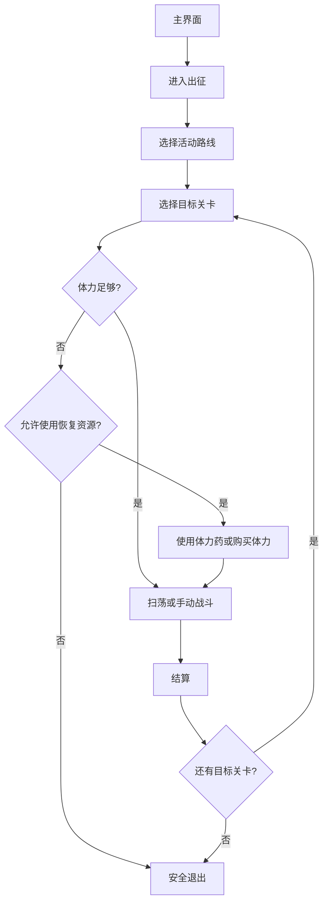
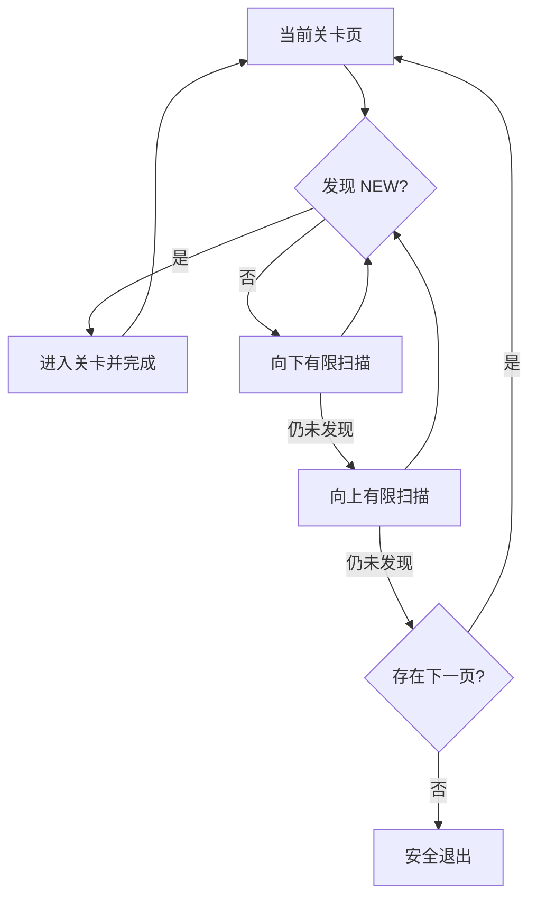
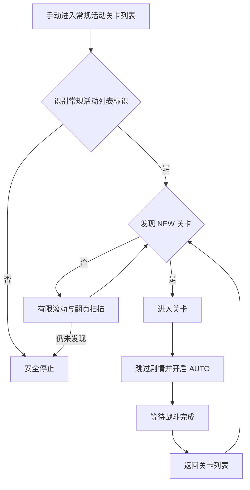

# 消耗体力（DailyStamina）

入口节点：`DailyStaminaStart`；实现涉及 `daily_stamina*.json`、`regular_activity.json`、`assets/stamina/active.yaml`、`tools/build_stamina_activities.py` 和 `agent/stamina.py`。原体力配置、生成方案、逻辑核查与待办已合并到本文。

## 前置状态

- 游戏位于主界面，目标活动和关卡已解锁。
- 在“体力消耗关卡”中确认目标；活动名称、路线、关卡文本和体力消耗以 `assets/stamina/active.yaml` 为源配置。
- 确认“扫荡不足时手动补刷”“使用体力药”和“购买体力”开关。后两项会消耗资源，默认关闭。
- 活动栏位本体分为常规活动、复刻活动和大型活动；活动开放数天后出现的挑战活动是附加入口，当前不纳入自动通关适配范围。
- 复刻活动使用二维地图路线；大型活动按真实内部 UI 分为“关卡图标页”和“直接关卡页”两条入口。两条大型活动路线动作与进入后的页面不同，不合并为同一状态链。

活动更新时在 `assets/stamina/active.yaml` 的 `activity_groups` 中维护活动级名称与 marker，并在 `cases` 中填写各关卡差异；跨活动复用的 UI 路线保留在 `templates`。具体字段、四类 UI 示例和更新步骤见 [`../develop/stamina_activity_config.md`](../develop/stamina_activity_config.md)。随后运行 `python tools/build_stamina_activities.py` 生成 `assets/interface.json` 中的活动 Case，不要直接编辑生成字段。提交前使用 `python tools/build_stamina_activities.py --check` 确认源配置与派生产物同步；脚本通过只代表配置一致，新增或变化的活动路线仍须在模拟器中验证。

当前复刻活动“兽耳乡的传说”的五个刷取选项使用右列最高级 `Free Quest`：`搜寻-02`、`秘宝-02`、`陷阱-02`、`料理-02`、`探险-02`，每次消耗 35 体力。用户选项省略 `-02`，实际 OCR 仍匹配完整关卡名，避免误刷左列低阶关卡。

## 主流程

1. 从主界面进入出征，由 `DailyStaminaPresetRouteStart` 选择限时活动或日常政务等统一外部路线。
2. 活动卡页默认已经选中第一栏，先检查当前活动名；不匹配时直接尝试第二栏、第三栏，不能再次点击第一栏，否则会进入第一栏活动。每次切换后仍须按活动名称确认，只有名称命中才点击“进击”。`DailyStaminaPresetInnerRouteStart` 必须再命中该路线的内部页面 marker，才会按常规、复刻、大型或自动通关切换内部 UI 路线；未进入时最多重试 4 次“进击”，仍失败则返回主界面。自动通关从 `RegularActivityStageListDecision` 推进带 `NEW` 标记的关卡。
3. 第一次进入第一个目标关卡详情后，由 `DailyStaminaCompare` OCR 当前体力，并与关卡消耗及保留值比较；只有尚未成功扫荡或战斗时，才允许按开关使用体力药或购买体力。
4. 体力足够时优先打开军团扫荡；扫荡不可用且开关启用时改为手动战斗。购买体力成功后执行已购买状态分发器，保证首次消费前最多购买一次。
5. 扫荡动画的“跳过”和结果页的“完成”分别识别与点击；成功扫荡或战斗后进入已消费状态。此后返回详情或进入自动通关的下一关时仍会比较体力，但体力不足只会安全退出，不再使用体力药或购买体力。

### 自动通关扫描

## 自动通关扫描策略

### 常规活动当前实现

常规活动进入本体后由 `RegularActivityStageListDecision` 驱动：

1. `RegularActivityOpenLatestStage` 在关卡标记 ROI `[130,160,120,940]` 内匹配实机裁剪的 `RegularActivity/NewStageMarker.png`，覆盖贴近列表顶部的标记并避开底部导航。
2. 模板候选按垂直位置排序，每轮只点击最上方 `NEW` 对应的关卡；星级、进度和装饰与完整模板不符，不作为候选。
3. 当前视口没有 `NEW` 时，依次执行 `RegularActivityScanStageListDown1~3`。每次从 `[360,760]` 滑到 `[360,360]` 后都重新检查 `NEW`，覆盖页面下方关卡。
4. 向下扫描仍未命中时，依次执行 `RegularActivityScanStageListUp1~3`。每次从 `[360,360]` 滑到 `[360,760]` 后都重新检查 `NEW`，覆盖页面上方关卡并回到靠上的位置。
5. 命中后点击该 `NEW` 对应的关卡，跳过可能出现的战前/战后剧情，完成战斗并返回地图，从返回后的当前视口重新开始整页扫描。
6. 当前页完成初始、向下和向上扫描仍没有 `NEW` 时，若识别到 `NEXT`，则点击下一页并重新执行完整扫描；单次任务最多点击 8 次 `NEXT`，避免末页按钮状态误识别造成循环。
7. 完整扫描后既没有 `NEW` 也没有可用的 `NEXT` 时结束自动通关。

纵向扫描沿用指定关卡搜索的方向、坐标和 1500 ms 滑动时长，但使用展开的 3 次向下加 3 次向上有限节点链，而不是依赖自循环 `max_hit`。这样每次翻页或战斗返回后都能重新执行完整扫描，不会因为前一页消耗了命中次数而跳过后续页面。

### 多个 NEW 的处理

`__RegularActivityNewText` 当前使用 TemplateMatch，并通过 `order_by: "Vertical"` 对候选按垂直位置排序；组合节点使用 `box_index: 0`，因此同一视口出现多个有效 `NEW` 时，每轮只选择最靠上的一个。完成该关卡并返回地图后重新扫描，再处理当前视口新的最靠上 `NEW`，不会在一次识别中连续点击多个关卡。若多个 `NEW` 分布在同页不同高度，则按扫描到的视口顺序逐个处理。`RegularActivityOpenLatestStage` 的 `max_hit: 20` 限制单次任务最多进入 20 个关卡。

### 复刻活动自动通关方案（待实现）

复刻活动的地图可横向和纵向移动，不能只复用常规活动的分页逻辑。计划使用纯 Pipeline 状态机，候选仍复用 `NEW` 模板匹配，每次只进入一个关卡：

1. **当前区域扫描**：从进入活动后的当前横向位置开始，检查当前视口，再有限次向上和向下滑动，覆盖当前列的完整纵向范围。
2. **建立底部锚点**：当前列没有 `NEW` 后滑到地图最底部，以稳定的底部页面作为横向移动起点。
3. **左侧区域扫描**：按实机确认的左滑手势移动到横向边界；到达边界后，再执行一次完整的上下扫描。
4. **右侧区域扫描**：回到底部锚点，按实机确认的右滑手势移动到另一侧横向边界；到达边界后，再执行一次完整的上下扫描。
5. **发现 NEW**：任何阶段命中 `NEW` 都立即进入关卡。战斗结束返回地图后，从当前视口重新开始扫描，避免依赖返回后的地图位置不变。
6. **结束条件**：当前区域、左侧区域和右侧区域均完成上下扫描且没有 `NEW` 时结束；体力不足、购买次数已用完或出现未知弹窗时走现有安全退出逻辑。

拟拆分为“当前列扫描、到达底部、左移到边界、左列扫描、右移到边界、右列扫描、结束”七组节点。现有 `DailyStaminaRerun*` 只用于寻找指定关卡，可参考其有限次滑动结构。

## 页面识别

| 页面状态       | 识别目标                                | 识别方式                    | ROI/素材                             |
| -------------- | --------------------------------------- | --------------------------- | ------------------------------------ |
| 活动区与活动卡 | 限时活动/目前活动及活动名称             | OCR                         | 由 YAML 模板生成 Override            |
| 关卡列表       | 目标关卡、列表 marker 或第一页 marker   | OCR                         | 由活动配置提供 ROI                   |
| 自动通关目标   | 关卡列表内的完整 `NEW` 标记             | TemplateMatch               | `RegularActivity/NewStageMarker.png` |
| 关卡详情       | 军团扫荡、体力值                        | OCR + `DailyStaminaCompare` | 体力 ROI 默认 `[500,0,180,45]`       |
| 战斗与结算     | `WAVE`/`TURN`、AUTO 关闭态、返回地图    | OCR + TemplateMatch         | `RegularActivity/AutoOffButton.png`  |
| 体力回复弹窗   | 回复方式、消耗数量、剩余次数、确认/取消 | OCR                         | 弹窗中央与底部按钮区                 |

## 异常与分支

- 首次消费前的体力不足弹窗会由游戏选择默认回复页：存在体力药时默认选中“使用道具回复”，没有体力药时默认选中“使用魔晶石回复”。Pipeline 先处理当前默认页；启用体力药时使用游戏排序最靠前的临期药品，每次只确认 1 瓶，首次消费前最多使用 10 瓶。只有当前页与用户启用的回复方式不一致时才主动切换标签；购买体力仍最多确认一次。成功扫荡或战斗后，已消费状态不再进入任何补充体力节点。
- 普通列表有限次上下扫描仍找不到关卡时安全返回，不无限滑动。
- 指定关卡只有在体力 OCR 明确满足“关卡消耗 + 预留值”且识别到“军团扫荡”按钮时才会打开扫荡；体力解析失败时返回主界面，不按“足够”处理。
- 自动通关只点击 `NEW` 模板命中的关卡；当前页没有目标时仅在确认 `NEXT` 已解锁后翻页。
- 自动通关复用普通关卡的活动分区、栏位选择和“进击”前置流程，只在进入活动本体后切换到 `RegularActivityStageListDecision`。活动卡页默认第一栏只检查名称，不重复点击；不匹配时从第二栏继续按名称寻找。
- 自动通关只处理活动本体，不进入活动开放数天后出现的挑战活动入口。
- 常规活动按当前视口、3 次向下、3 次向上的顺序覆盖整页，整页没有 `NEW` 后才按 `NEXT` 翻页。
- 战斗等待循环会同时识别 `WAVE`/`TURN` 和灰色 AUTO 关闭态；只有 `RegularActivity/AutoOffButton.png` 命中时才点击开启，已开启状态不会被反向关闭。
- 自动通关只有在第一次进入第一个待通关关卡、且尚未成功战斗时允许补充体力。当前默认页为魔晶石时直接购买；仅在背包仍有药、游戏默认停在道具页而用户未启用药水时，才主动切换到“使用魔晶石回复”。两个开关同时启用时沿用游戏默认顺序，即“有药先用药、无药直接购买”。药品列表由游戏按过期时间排序，同过期时间和同档位合并显示库存；已知回复档位为 10、60、100。Pipeline 不直接计算组合，而是逐次使用默认最临期的 1 瓶，并以重新尝试第一个关卡是否仍弹出体力不足作为精确停止条件。完成第一场战斗后，后续关卡体力不足直接结束自动通关。
- 魔晶石回复页会显示本次价格、回复量和今日剩余次数；现有购买节点仅确认弹窗类型，不限制价格。
- 魔晶石不足且游戏提示使用魂晶购买魔晶石时，Pipeline 会点击该提示的“取消”，回到魔晶石回复页，再复用未购买时的关闭弹窗与返回主界面流程；不会消耗魂晶。
- 确认购买后弹窗不会自动关闭，而是立即刷新成下一次购买确认；Pipeline 会点击“取消”关闭弹窗，并由 `DailyStaminaCurrencyPurchasedState` 或 `RegularActivityCurrencyPurchasedState` 记录本次任务已经购买。后续仍有足够体力时继续扫荡/战斗，再次体力不足时直接退出，不再点击入口并打开第二个购买弹窗。
- 道具回复页空状态文本为“目前没有任何的药水可供使用”。有药时弹窗默认选中列表最前的一瓶并显示“是否消耗 1……兑换……体力”；确认后弹窗不会关闭，而是刷新并默认选择下一批药，因此使用节点额外校验数量必须为 1，并在每次使用后主动取消刷新弹窗。
- `DailyStaminaStartSweep` 点击后不等待全屏静止，立即分别监听上下两个实机位置的“跳过”；动画结束后由独立的“完成”节点点击固定中心。只有点击过“跳过”或“完成”后，结果分发器才允许把关卡详情识别为扫荡完成，避免动作尚未生效时提前回到详情决策。
- `DailyStaminaStartSweep` 在 180 秒内未识别到已知后续页面时进入
  `DailyStaminaRecoverSweepTimeout`。恢复分发器只处理已有 Loading、体力回复、扫荡结算、关卡详情、
  关卡列表和主界面；均不匹配时由 `DailyStaminaStopAfterSweepTimeout` 直接停止，不点击未知弹窗。

## 完成状态

- 成功条件：完成目标扫荡/自动通关，或达到体力、道具、关卡解锁等停止条件。
- 安全退出位置：游戏主界面；未知补充体力弹窗优先取消，不进行资源消耗。

## 自动战斗

自动战斗是独立任务，不从主界面寻路，也不要求选择活动名称。使用前手动进入任意常规活动的关卡列表，再启动“自动战斗”任务。

当前版本只支持常规活动本体，不自动补充体力；体力不足、未知页面或未识别到活动列表时安全停止。复刻活动和大型活动后续通过独立活动类型路线扩展。
