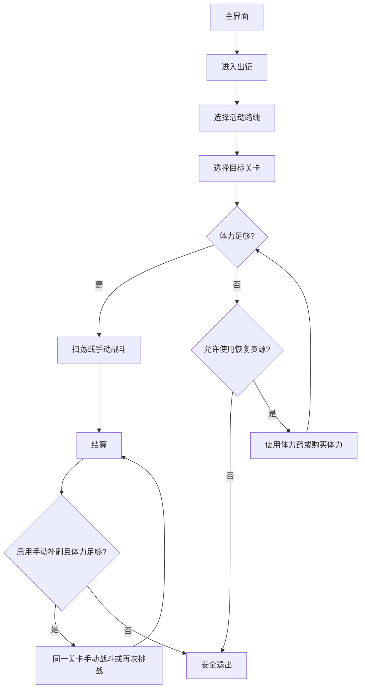

# 消耗体力（DailyStamina）

入口节点：`DailyStaminaStart`；实现涉及 `daily_stamina*.json`、`assets/stamina/active.yaml`、`tools/build_stamina_activities.py` 和 `agent/stamina.py`。本文描述指定关卡的扫荡与手动补刷；按 `NEW` 推进未通关关卡见独立的[自动战斗](auto_battle.md)。

## 前置状态

- 游戏位于主界面，目标活动和关卡已解锁。
- 在“体力消耗关卡”中确认目标；活动名称、路线、关卡文本和体力消耗以 `assets/stamina/active.yaml` 为源配置。
- 确认“扫荡不足时手动补刷”“使用体力药”和“购买体力”开关。后两项会消耗资源，默认关闭。
- 活动栏位本体分为常规活动、复刻活动和大型活动；活动开放数天后出现的挑战活动是附加入口，当前不纳入适配范围。
- 进入活动本体后，内部 UI 必须先分为四类：常规活动 UI、复刻活动 UI、大型活动特殊 UI、日常政务 UI。
  常规活动 UI 还要继续区分普通纵向关卡列表和常规活动分页关卡列表，两者的目标扫描与翻页方式不同。
- 复刻活动使用二维地图路线；大型活动按真实内部 UI 分为“关卡图标页”和“直接关卡页”两条入口。两条大型活动路线动作与进入后的页面不同，不合并为同一状态链。

活动更新时在 `assets/stamina/active.yaml` 的 `activity_groups` 中维护活动级名称与 marker，并在 `cases` 中填写各关卡差异；跨活动复用的 UI 路线保留在 `templates`。具体字段、四类 UI 示例和更新步骤见 [`../develop/stamina_activity_config.md`](../develop/stamina_activity_config.md)。随后运行 `python tools/build_stamina_activities.py` 生成 `assets/interface.json` 中的活动 Case，不要直接编辑生成字段。提交前使用 `python tools/build_stamina_activities.py --check` 确认源配置与派生产物同步；脚本通过只代表配置一致，新增或变化的活动路线仍须在模拟器中验证。

## 主流程

1. 从主界面进入出征，由 `DailyStaminaPresetRouteStart` 选择限时活动或日常政务等统一外部路线。
2. 活动卡页默认已经选中第一栏，先检查当前活动名；不匹配时直接尝试第二栏、第三栏，不能再次点击第一栏，否则会进入第一栏活动。每次切换后仍须按活动名称确认，只有名称命中才点击“进击”。`DailyStaminaPresetInnerRouteStart` 必须先确认内部页面 marker，再进入对应 UI 路线：常规活动 UI 进入普通纵向列表或分页列表，复刻活动 UI 进入二维地图，大型活动特殊 UI 进入活动专用路线，日常政务 UI 进入政务分类列表。未进入时最多重试 4 次“进击”，仍失败则返回主界面。
3. 第一次进入第一个目标关卡详情后，由 `DailyStaminaCompare` OCR 当前体力，并与关卡消耗及保留值比较；只有尚未成功扫荡或战斗时，才允许按开关使用体力药或购买体力。
4. 体力足够时优先打开军团扫荡；扫荡不可用且开关启用时改为手动战斗。购买体力成功后执行已购买状态分发器，保证首次消费前最多购买一次。
5. 扫荡动画的“跳过”和结果页的“完成”分别识别与点击；成功扫荡或战斗后进入已消费状态。扫荡后由 `DailyStaminaAfterSweepDecision` 判断是否手动补刷；战斗结算时体力足够则点击“再次挑战”，不足则返回地图并退出，不再补充体力。

## 内部 UI 分类与关卡列表适配

进入活动本体后，先识别内部 UI 类型，再选择关卡搜索路线：

| UI 类型         | 关卡列表形态           | 当前路线                                                                          |
| --------------- | ---------------------- | --------------------------------------------------------------------------------- |
| 常规活动 UI     | 普通纵向列表           | `DailyStaminaRouteInnerNormalListStart`                                           |
| 常规活动 UI     | 分页列表               | `DailyStaminaRouteRegularPagedFirstPageStart`                                     |
| 复刻活动 UI     | 横向/纵向二维地图      | `DailyStaminaRouteInnerRerunUiStart`                                              |
| 大型活动特殊 UI | 活动专用关卡页或图标页 | `DailyStaminaRouteInnerSpecialUiStart` / `DailyStaminaRouteInnerChallengeUiStart` |
| 日常政务 UI     | 分类后的常规关卡列表   | `DailyStaminaRouteDailyAffairsStart`                                              |

常规活动 UI 不能和复刻活动 UI 合并处理。普通纵向列表只需要有限上下滑动；分页列表必须先确认当前页和分页按钮，再执行翻页。两者共享目标关卡识别与关卡详情决策，但列表边界和返回条件分别维护。

## 选项与手动补刷

- “体力消耗关卡”提供指定关卡、路线、识别文本及体力阈值；当前启用配置不包含自动通关 Case。
- “扫荡不足时手动补刷”控制 `DailyStaminaManualStart`，默认关闭。扫荡后或扫荡对话框后继超时进入该分支时，必须先由 Agent 确认体力足够。
- “体力不足时使用体力药”和“体力不足时购买体力”控制首次消费前的回复分支，默认关闭。
- 手动补刷由 `DailyStaminaWaitBattleResult` 等待结算，使用同一关卡的配置阈值判断“再次挑战”或“返回地图”。该流程只监听战斗进行标识，没有自动开启 AUTO 的节点，运行前需自行确认战斗设置。

## 页面识别

| 页面状态       | 识别目标                                            | 识别方式                    | ROI/素材                       |
| -------------- | --------------------------------------------------- | --------------------------- | ------------------------------ |
| 活动区与活动卡 | 限时活动/目前活动及活动名称                         | OCR                         | 由 YAML 模板生成 Override      |
| 关卡列表       | 目标关卡、列表 marker 或第一页 marker               | OCR                         | 由活动配置提供 ROI             |
| 关卡详情       | 军团扫荡、体力值                                    | OCR + `DailyStaminaCompare` | 体力 ROI 默认 `[500,0,180,45]` |
| 战斗与结算     | `WAVE`/`TURN`、`CLEAR`/获得道具、再次挑战、返回地图 | OCR + `DailyStaminaCompare` | `DailyStaminaWaitBattleResult` |
| 体力回复弹窗   | 回复方式、消耗数量、剩余次数、确认/取消             | OCR                         | 弹窗中央与底部按钮区           |

## 异常与分支

- 首次消费前的体力不足弹窗会由游戏选择默认回复页：存在体力药时默认选中“使用道具回复”，没有体力药时默认选中“使用魔晶石回复”。Pipeline 先处理当前默认页；启用体力药时使用游戏排序最靠前的临期药品，每次只确认 1 瓶，首次消费前最多使用 10 瓶。只有当前页与用户启用的回复方式不一致时才主动切换标签；购买体力仍最多确认一次。成功扫荡或战斗后，已消费状态不再进入任何补充体力节点。
- 普通列表有限次上下扫描仍找不到关卡时安全返回，不无限滑动。
- 指定关卡只有在体力 OCR 明确满足“关卡消耗 + 预留值”且识别到“军团扫荡”按钮时才会打开扫荡；体力解析失败时返回主界面，不按“足够”处理。
- 魔晶石回复页会显示本次价格、回复量和今日剩余次数；现有购买节点仅确认弹窗类型，不限制价格。
- 魔晶石不足且游戏提示使用魂晶购买魔晶石时，Pipeline 会点击该提示的“取消”，回到魔晶石回复页，再复用未购买时的关闭弹窗与返回主界面流程；不会消耗魂晶。
- 确认购买后弹窗不会自动关闭，而是立即刷新成下一次购买确认；Pipeline 会点击“取消”关闭弹窗，并由 `DailyStaminaCurrencyPurchasedState` 记录本次任务已经购买。后续仍有足够体力时继续扫荡/战斗，再次体力不足时直接退出，不再点击入口并打开第二个购买弹窗。
- 道具回复页空状态文本为“目前没有任何的药水可供使用”。有药时弹窗默认选中列表最前的一瓶并显示“是否消耗 1……兑换……体力”；确认后弹窗不会关闭，而是刷新并默认选择下一批药，因此使用节点额外校验数量必须为 1，并在每次使用后主动取消刷新弹窗。
- `DailyStaminaStartSweep` 点击后不等待全屏静止，立即分别监听上下两个实机位置的“跳过”；动画结束后由独立的“完成”节点点击固定中心。只有点击过“跳过”或“完成”后，结果分发器才允许把关卡详情识别为扫荡完成，避免动作尚未生效时提前回到详情决策。
- `DailyStaminaStartSweep` 在 180 秒内未识别到已知后续页面时进入
  `DailyStaminaRecoverSweepTimeout`。恢复分发器只处理已有 Loading、体力回复、扫荡结算、关卡详情、
  关卡列表和主界面；均不匹配时由 `DailyStaminaStopAfterSweepTimeout` 直接停止，不点击未知弹窗。

## 完成状态

- 成功条件：完成目标关卡扫荡/手动补刷，或达到体力、道具、关卡解锁等停止条件。
- 已知页面通过详情/列表返回与公共主界面确认结束；扫荡超时且页面无法识别时，`DailyStaminaStopAfterSweepTimeout` 原地停止，不能保证返回主界面。可识别的补充体力弹窗优先取消。
