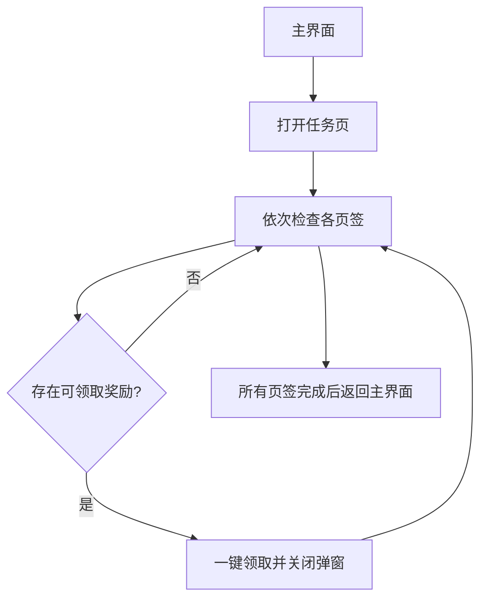

# 奖励领取（DailyTaskRewards）

入口节点：`DailyTaskRewardsStart`；实现文件：`assets/resource/pipeline/daily_task_rewards.json`。

## 前置状态

- 游戏位于主界面，任务页面已解锁。
- 每日、每周、每月、个人、活动和协会页签可能没有可领取奖励。

## 主流程

1. 从主界面打开任务页面并选择每日页签。
2. 同时确认任务页标题、可领取文本和一键领取按钮；命中后点击并关闭奖励或仓库堆叠上限弹窗。
3. 依次处理每周、每月、个人、活动和协会页签。
4. 全部页签处理完成后返回主界面。

## 页面识别

| 页面状态     | 识别目标                                 | 识别方式 | ROI/素材                                                |
| ------------ | ---------------------------------------- | -------- | ------------------------------------------------------- |
| 任务页面     | 任务                                     | OCR      | 页面标题区                                              |
| 页签         | 每日、每周、每月、个人、活动、协会       | OCR      | 两行页签区域                                            |
| 可领取状态   | 可领取                                   | OCR      | 任务列表区域                                            |
| 领取按钮     | 一键领取                                 | OCR      | 页面底部按钮区                                          |
| 普通奖励弹窗 | 奖励已增加至仓库                         | OCR      | 按正文纵坐标区分紧凑和展开布局                          |
| 仓库上限弹窗 | 可领取的物品已超过堆叠上限，请至仓库确认 | OCR      | 页面中部提示区                                          |
| 弹窗按钮兜底 | 确定、确认                               | OCR      | 页面中部至下部按钮区，`DailyTaskRewardsCloseClaimPopup` |

## 异常与分支

- 返回主界面不再等待全屏静止，交给公共结束确认；入口通过公共恢复关闭礼包，避免被登录遗留页面阻挡。
- 某页签无可领取任务时直接进入下一页签，不点击固定位置。
- 领取动作使用 And 组合页面标题、可领取文本和按钮，并通过 `box_index: 2` 点击按钮识别框。
- 每个页签限制最大领取次数。普通奖励弹窗按“奖励已增加至仓库”的纵坐标区分紧凑和展开布局，仓库上限弹窗
  识别完整提示正文；两者均点击各自稳定的确认区域，再返回当前页签继续判断。
- `DailyTaskRewardsCloseClaimPopup` 继续以“确定/确认”OCR 作为兜底，避免未知弹窗布局阻挡后续页签点击。

## 完成状态

- 成功条件：六个页签均已检查并领取当前可领取奖励。
- 安全退出位置：游戏主界面。

## 当前状态

- 2026-09-13，客户端 2.3.0，MuMuPlayer v5+，MaaMCP 原生截图与输入：进入任务页、依次检查
  每日、每周、每月、个人、活动、协会页签并返回主界面的路径通过，修复后未再出现返回阶段的 20 秒稳定等待超时。
- 本轮未命中实际领取分支，实际奖励领取、普通奖励弹窗与仓库上限弹窗仍待验证。
- 公共恢复详见 [公共主界面恢复](common_navigation.md)。
