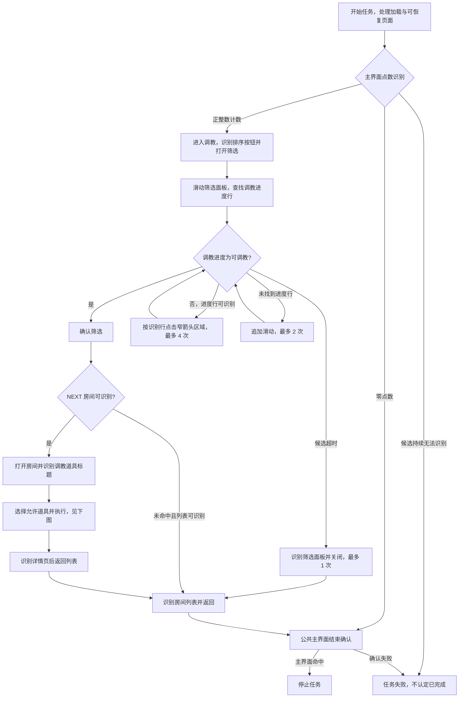
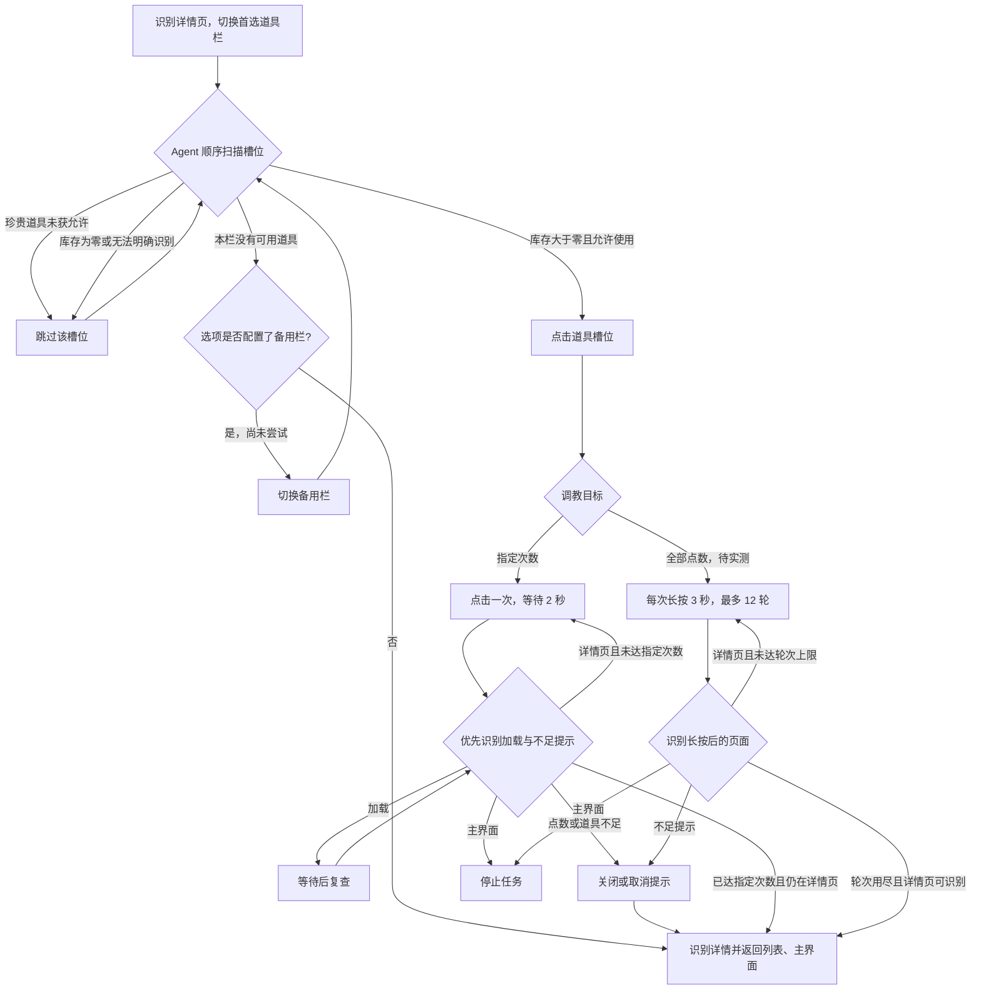

# 调教（DailyTraining）

入口节点：`DailyTrainingStart`；实现文件：`assets/resource/pipeline/daily_training.json`、`agent/training.py`。

## 前置状态

- 游戏位于主界面，调教功能已解锁。
- 确认调教目标、道具范围和珍贵道具开关；“指定次数”模式填写 1–100 次，界面默认 5 次。
- 默认优先通用道具，珍贵道具开关关闭。调教会消耗点数与选定道具，不自动购买或补充资源。

## 主流程

1. 识别完整的主界面调教点数，正数时进入，零点数时结束；读不清不能按有点数处理。
2. 打开排序筛选面板，滑动查找“调教进度”，将该行切换为“可调教”，再确认。
3. 进入当前角色的 `NEXT` 房间；没有命中 `NEXT` 且列表仍可识别时返回主界面。
4. 按选项依次扫描通用或活动栏，只选择库存明确大于零且允许使用的槽位。
5. 指定次数模式每次点击后重新识别页面，再决定继续或返回；全部点数模式按原有有限长按流程执行。
6. 正常完成、道具不可用或出现资源不足提示时，按已知页面返回并确认主界面。

滑动与循环次数都是单次任务内的节点上限。当前流程处理选中的一个 `NEXT` 房间后返回，
没有自动切换到下一个角色或再次筛选房间的循环。公共结束确认见 [公共主界面恢复](common_navigation.md)。

图中槽位扫描由 Agent 完成，跨页面跳转与点击次数由 Pipeline 控制。未识别到已知后继时可能失败，
不能把图中的正常返回当作对任意未知页面的保证。全部点数、资源不足弹窗等未实测分支不据此宣称通过。

## 页面识别与实现映射

| 页面或决策 | 识别依据                                             | 对应节点或实现                                                       |
| ---------- | ---------------------------------------------------- | -------------------------------------------------------------------- |
| 主界面点数 | 完整正整数或全零计数，兼容斜杠两侧空格               | `__DailyTrainingMainHasCount` / `__DailyTrainingMainZeroCount`       |
| 排序入口   | 入手顺序、图鉴顺序及原有排序文字                     | `DailyTrainingOpenFilter`                                            |
| 筛选面板   | 筛选排序                                             | `DailyTrainingFilterPanelTop`                                        |
| 筛选进度行 | 调教进度、可调教；适应滑动后的纵向位置               | `DailyTrainingSetProgressFilter`                                     |
| 房间列表   | NEXT、CLEAR 或排序文字                               | `DailyTrainingEnterNextRoom` / `DailyTrainingReturnMainFromRoomList` |
| 房间详情   | 下方完整“调教道具”标题                               | `DailyTrainingSelectConfiguredItem`                                  |
| 库存       | 固定槽位下方整数库存，可带千位分隔符或数量前缀       | `DailyTrainingChooseItem`，位于 `agent/training.py`                  |
| 选物分发   | 有库存识别成功才点击；识别失败触发选项配置的备用路线 | `DailyTrainingChooseCommonItem` / `DailyTrainingChooseEventItem`     |
| 道具点击   | 自定义识别返回的允许槽位框                           | `DailyTrainingClickCommonItem` / `DailyTrainingClickEventItem`       |
| 指定次数   | 每次执行后重查，次数输入覆盖命中上限                 | `DailyTrainingClickCenterSlow.max_hit`                               |
| 不足提示   | 调教点不足、补充能量、道具不足等现有提示             | `DailyTrainingCloseEnergyPrompt` / `DailyTrainingCloseShortagePopup` |

## 选项与资源边界

- “指定次数”输入覆盖 `max_hit`，不再覆盖 `repeat`，避免资源不足后仍连续盲点。次数统计的是点击动作，
  不保证游戏实际接受了每次操作；未经过 Interface 的裸 Pipeline 默认最多点击 3 次。
- “优先通用道具”先通用后活动；“优先活动道具”和“活动和通用都可”先活动后通用。
  Interface 将选物分发节点的 `on_error` 指向备用栏，备用栏失败后返回。
- Agent 默认排除通用 +2400 与活动 +2000 槽位，只在开关明确为布尔真时允许它们。
- 库存 OCR 为空、混入效果数值、百分比或多个数字时跳过该槽位，并在诊断中保留 `unreadable_count`；
  不把识别失败解释为“可能有道具”。参数或道具栏名非法时返回识别失败。
- 全部点数模式仍采用最长 12 轮、每轮 3 秒的长按策略，不保证实际耗尽全部点数；本轮不测试大量消耗。

## 异常与返回

- 实际排序按钮可显示“入手顺序”；遗漏该文本会卡在房间列表。
- 本轮“调教进度”文字曾位于 y=817、853、859 等位置；读取完整行后将点击限制在右侧窄箭头区域，
  不用旧的固定 y=828，也不在平移后的整个文字宽度中随机点击。
- 筛选失败时先识别筛选面板再关闭，随后尝试返回主界面。无 `NEXT` 时由确认筛选节点选择列表返回，
  不依赖未命中房间节点本身的 `on_error`。
- 选物分发节点先执行，再识别候选道具；这样库存无匹配时，配置在分发节点上的 `on_error` 才能触发。
- 详情返回兜底也要求识别“调教道具”，不在未知页面直接点返回坐标。所改动作保留点击前 300 毫秒稳定等待。
- 房间切换、道具栏切换和返回由目标页面识别承接，取消这些路径的全屏静止等待。

## 完成状态

- 正常目标：使用允许道具完成指定次数，或按配置消耗可用点数。
- 实际结束条件还包括零点数、无可识别房间、无可用道具、资源不足与次数上限；只有主界面确认后才是正常返回。
- 任务停止不等同于指定次数均被游戏接受；需结合点击节点次数、点数与库存变化核对。

## 当前状态

- 2026-09-13，客户端 2.3.0，MuMuPlayer v5+，MaaMCP 原生输入与截图：修复后完整入口通过，
  覆盖排序入口、滑动查找进度、切换可调教、进入 NEXT 房间、通用道具库存识别、单次调教和返回确认，约 43.4 秒。
- 本次选择“指定次数 = 1、优先通用道具、珍贵道具关闭”；通过 Interface 选项合并生成测试节点副本。
  实际只命中一次调教动作，消耗 1 点及 1 个普通 +120 道具，库存与点数变化均已核对；没有使用珍贵道具。
- 三条故障注入路径通过：使两个栏位的自定义识别失败后按顺序回退并退出、禁用 NEXT 候选后从列表退出、
  禁用筛选候选后触发筛选关闭和返回。这些测试验证回退连接，不等同于真实库存耗尽、房间全满或 OCR 故障实测。
- 7 项离线回归覆盖库存解析、未知库存跳过、珍贵道具开关、非法参数、零点数与正数互斥及次数绑定。
  maa-tools、Schema、格式与交互稳定等待检查通过。
- 全部点数模式、指定多次消耗、活动道具实际使用、珍贵道具实际使用、资源不足弹窗、真实零点数、
  房间全满与网络异常仍待验证。次数输入的 GUI 端到端路径也未覆盖。

离线回归命令：`python tools/test_training.py`。设备测试通过 Interface 配置合并生成本地节点副本时，
须说明所用选项，不将其等同于 GUI 选项输入端到端测试。
