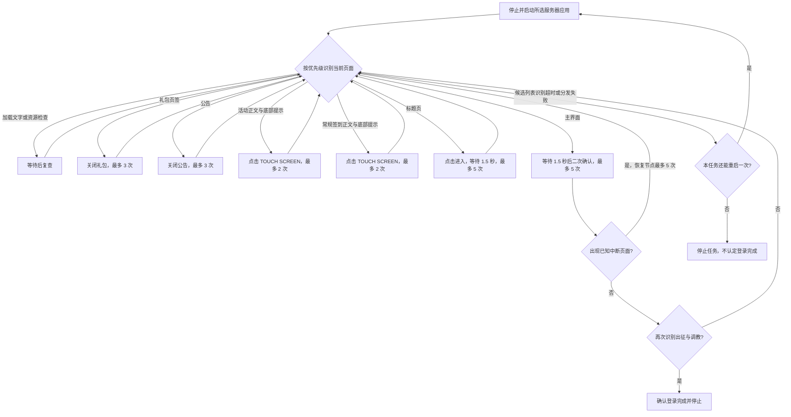

# 启动游戏（GameLogin）

入口节点：`GameLoginStart`；实现文件：`assets/resource/pipeline/game_login.json`。

## 背景说明

官服与 erolab 服务器提供相同的游戏内容、页面布局和登录流程，因此共用同一套登录 Pipeline。两者的
发行渠道和 Android 包名不同：官服使用 `com.pinkcore.tkfm`，erolab 使用
`com.pinkcore.tkfm.erolabs`；任务选项“选择服务器”仅通过 Interface Override 切换启停应用使用的包名。

## 前置状态

- 模拟器已安装所选服务器对应的游戏包，并允许从主界面启动应用。
- 在任务选项“选择服务器”中确认包名：工口服务器为 `com.pinkcore.tkfm`，erolab 服务器为 `com.pinkcore.tkfm.erolabs`。

## 主流程

1. 关闭已运行的游戏应用，再启动所选服务器的游戏包。
2. 启动后进入统一状态分发器，按当前画面处理加载、资源检查、公告、标题页、首登弹窗、礼包和主界面。
3. 通过 `TAP TO START` 或版本号确认标题页后点击进入游戏，再返回同一状态分发器识别点击后的新页面；
   点击未生效时由同一节点限频、有限次重试。
4. 出现活动登录奖励或常规签到时，同时识别正文与底部 `TOUCH SCREEN`，点击提示后重新判断页面；
   出现王城公布栏时关闭公告。页面顺序由当前画面决定，不要求每次登录都出现全部页面。
5. 优先处理包含限时、精选、月卡页签的礼包，通过左上角返回按钮回到状态分发器。
6. 首次识别主界面后进入 1.5 秒二次确认窗口；期间出现礼包、签到或加载时重新分发，再确认主界面后结束。

图中分支按当前画面选择，加载、礼包、公告、活动签到、常规签到、标题和主界面依次具有识别优先级。
分发器的候选列表超时为 360 秒，不是整轮登录的总时限；达到次数上限的节点不再执行。

## 页面识别

| 页面状态   | 识别目标                             | 识别方式  | 动作                                |
| ---------- | ------------------------------------ | --------- | ----------------------------------- |
| 资源检查   | `资源检查中`或`档案读取中`           | OCR       | 等待并返回所属状态分发器            |
| 启动加载   | `LOADING`/`LOAD ING`                 | OCR       | 等待并返回所属状态分发器            |
| 王城公布栏 | `王城公布栏`、`活动公告`或`最新公告` | OCR       | 点击底部关闭区域                    |
| 标题页     | `TAP TO START` 或版本号              | OCR       | 点击底部进入区域                    |
| 活动签到   | 活动正文与 `TOUCH SCREEN` 同时存在   | And + OCR | 点击识别出的底部提示                |
| 常规签到   | 签到正文与 `TOUCH SCREEN` 同时存在   | And + OCR | 点击识别出的底部提示                |
| STEP 礼包  | `STEP`、限时、精选或月卡页签         | OCR       | 点击左上角返回区域                  |
| 主界面     | 出征与调教同时存在                   | And + OCR | 二次确认后 `GameMainReady` 停止任务 |

## 异常与分支

- 活动签到的 `LOGIN` 与 `REWARDS` 在当前画面中分为两行，原单行表达式无法命中；
  增加完整行 `REWARDS` 识别，同时仍要求底部 `TOUCH SCREEN`，点击提示后重新分发。

- 礼包优先于签到，签到须同时存在底部 `TOUCH SCREEN` 提示，避免主界面的“签到奖励”误命中。
  关闭页面后立即重新识别，不等待角色动画停止；二次确认期间出现新页面时重新进入分发器。
- 历史流程记录（当前客户端完整路径待复核）描述：标题页前王城公布栏、活动登录奖励、常规签到和标题页后王城公布栏只在
  当日首次登录出现；同日再次登录从标题页后的资源检查直接进入 STEP 礼包页。
- 活动签到、常规签到或公告未出现时不应等待固定顺序，而应继续判断礼包页和主界面。
- `GameLoginDispatch` 是状态分发器，使用 `DirectHit + DoNothing`，按当前页面选择处理节点。
  `timeout: 360000` 是候选列表识别超时，并非整个登录过程的总耗时上限；MaaMCP 测试另设人工超时。
- 加载、资源检查、首登弹窗、公告、礼包和标题点击全部通过 `[JumpBack]` 返回状态分发器。会改变页面的
  动作节点不再配置自己的 `next`，避免点击后框架继续以旧页面节点为当前 PipelineNode。
- 标题页不使用 `TOUCH SCREEN` 识别，避免签到页被当成标题页。两类签到使用正文与底部提示的组合识别，
  `box_index: 1` 输出提示的识别框，点击该框；礼包只点击左上角固定返回区域。
- 标题页点击后不要求再次识别 `TAP TO START`；状态分发器会直接识别加载、资源检查、首登弹窗、公告、
  礼包或主界面。仍停留标题页时才会再次命中标题节点。
- 标题点击最多 5 次，点击后等待 1.5 秒再识别。加载文字完整覆盖底部提示，兼容字母间空格，
  `LOADING` / `CONNECTING` 识别命中时只等待，不因仍能看到版本号而继续点击。
- `GameLoginConfirmMain` 在主界面首次命中后留出 1.5 秒观察窗口。`GameLoginMainInterrupted` 优先检查
  礼包、签到、公告、加载和标题；任何一项出现都重新分发，否则重新识别主界面后停止。
  两个确认节点各最多命中 5 次，避免异常页面反复打断造成无限重试。
- `GameLoginDispatch` 在 360 秒内始终无法识别已知页面时，通过 `GameLoginRestartOnce` 最多一次转回
  `GameLoginStart`，复用服务器选项已经覆盖的停止和启动节点。重启后的状态分发器再次超时则由
  `GameLoginStopAfterTimeout` 明确停止任务，不继续重启，也不点击未知页面。
- 网络错误、服务器维护或资源更新页面目前没有专用恢复节点，出现时应安全停止并补充流程记录。

## 完成状态

- 成功条件：通过 `GameLoginConfirmMain` 的观察窗口，中断页面未命中，并由 `GameMainReady` 再次确认主界面后停止。
- 安全退出位置：游戏主界面；无法识别已知页面时不得盲点继续。
